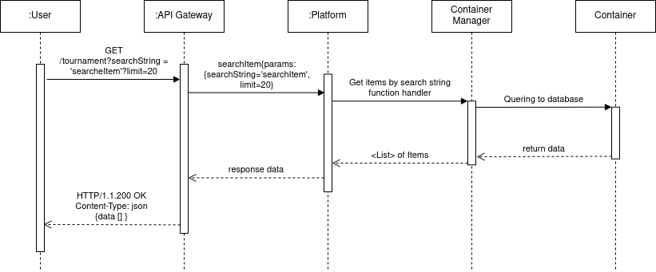

# Содержание
1. [Моделирование динамического поведения системы](#1)  
1.1. [Диаграммы последовательности](#1.1)  
1.2. [Диаграммы активности](#1.2)   
1.3. [Диаграммы состояний](#1.3)  

<a name="1"/>

#  1. Моделирование динамического поведения системы

<a name="1.1"/>

##  1.1. Диаграммы последовательности

Создание нового турнира администратором:

Последовательность запроса данных турнира пользователем:

<a name="1.2"/>
